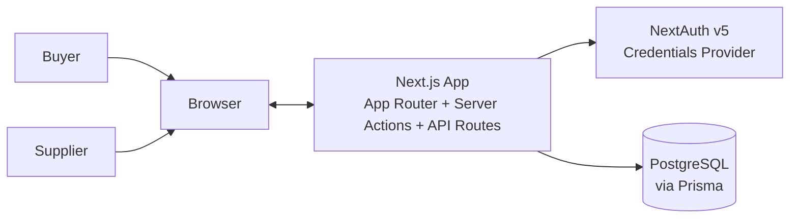
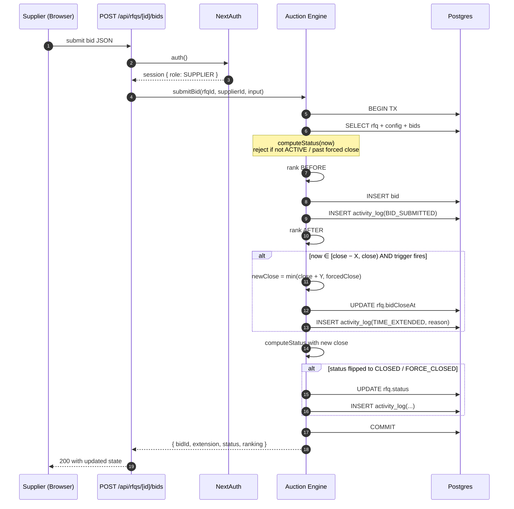
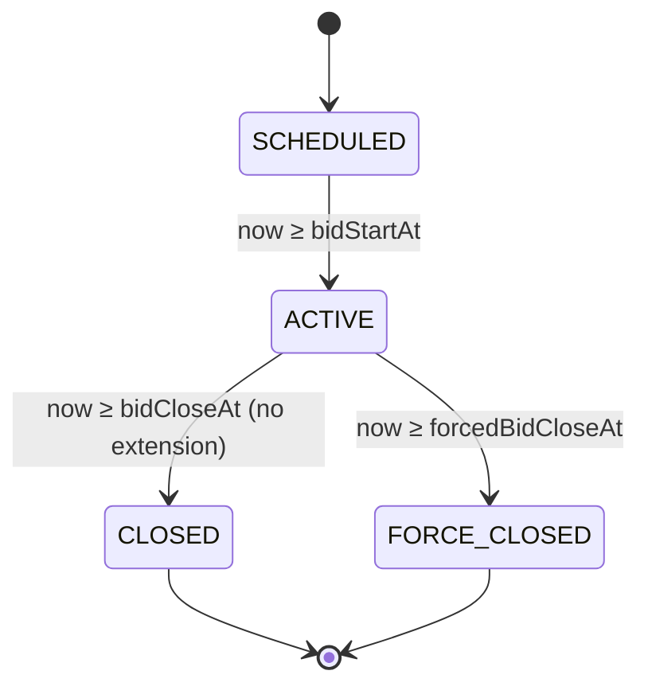

# HLD — British Auction RFQ System

## 1. System context

- **Single Next.js process** hosts UI (React server components), server actions, API routes, and the auction engine.
- **PostgreSQL** is the only source of truth. All time math and ranking happens against the DB inside a single transaction on bid submission.
- **No background jobs / websockets.** Status transitions happen **lazily** on read (`syncAuctionStatus`) and on write (`submitBid`). Listing/details pages `router.refresh()` every 10–15s to pick up changes.

## 2. Components

| Component | Path | Responsibility |
|---|---|---|
| Auction Engine | `src/lib/auction/engine.ts` | Status computation, `submitBid` transaction, extension logic |
| Ranking | `src/lib/auction/ranking.ts` | Pure ranking + `l1Changed` / `anyRankChanged` predicates |
| Validators | `src/lib/auction/validators.ts` | Zod schemas + cross-field rules (`forcedClose > close`, etc.) |
| Server Actions | `src/lib/actions/rfq.ts` | `createRfqAction` — validates + inserts RFQ + config |
| API Routes | `src/app/api/rfqs/**` | REST surface for listing, detail, bid submission |
| Auth | `src/lib/auth.ts`, `src/middleware.ts` | Credentials provider, JWT session with `role`, route guards |
| UI | `src/app/**`, `src/components/**` | Listing, details, create form, bid form |

## 3. Key sequence — bid submission with extension

## 4. Status state machine

Terminal states never regress. `computeStatus` guards this.

## 5. Extension trigger semantics

Given trigger window `X` and extension `Y`, on every bid at time `now`:

| Trigger | Fires when |
|---|---|
| `BID_RECEIVED` | any bid submitted in `[close − X, close)` |
| `ANY_RANK_CHANGE` | ranking of any supplier moves relative to the pre-bid snapshot, AND in window |
| `L1_RANK_CHANGE` | the L1 supplier changes, AND in window |

New close: `newClose = min(close + Y, forcedClose)`. The extension is applied only if `newClose > close`; otherwise the engine emits nothing (no meaningless log entries).

## 6. Key design decisions

- **`bidCloseAt` is mutable, `forcedBidCloseAt` is immutable.** Extensions only move `bidCloseAt`; forced close is a hard cap that can never move once the RFQ is created.
- **Lazy status sync.** Rather than a cron/worker, `syncAuctionStatus` is invoked on every list / detail request and inside `submitBid`. This gives us "correct at the moment someone looks" for free, with zero infra.
- **Ranking uses only each supplier's latest bid.** Suppliers submit multiple bids over time; only the newest one counts toward their standing. Older bids remain in the history table.
- **Ties broken by submission time.** Whoever hit the price first keeps the higher rank — this matches real auction fairness expectations.
- **All extension math inside a single Prisma transaction.** Prevents two concurrent bids from both computing extensions off the same pre-bid state.
- **Auth is mock credentials + JWT.** Passwords are bcrypt-hashed in the DB so the demo mirrors a real auth flow, but everyone shares the same password (`demo123`) for reviewer convenience.

## 7. What's intentionally NOT here

- Real websocket push. Auto-refresh (`router.refresh()` on a 10–15s interval) is enough for the demo and keeps the stack simple.
- Background scheduler to force-close idle auctions. Not needed — the next read or bid does the transition.
- Multi-buyer isolation. Any authenticated user sees any RFQ. Trivial to gate on `createdById` if needed.
