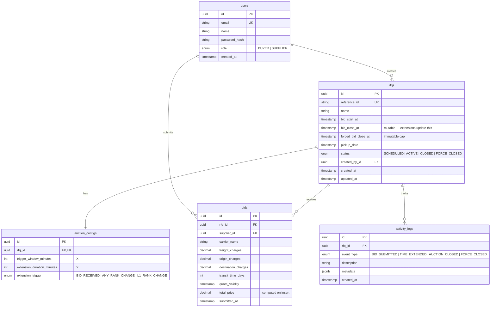

# Database Schema

Source of truth: [`prisma/schema.prisma`](../prisma/schema.prisma).

## ER diagram

## Tables

### `users`

| Column | Type | Notes |
|---|---|---|
| `id` | UUID PK | |
| `email` | text UNIQUE | login identifier |
| `name` | text | display name |
| `password_hash` | text | bcrypt |
| `role` | enum `Role` | `BUYER` or `SUPPLIER` |
| `created_at` | timestamptz | |

### `rfqs`

| Column | Type | Notes |
|---|---|---|
| `id` | UUID PK | |
| `reference_id` | text UNIQUE | human-facing ID e.g. `RFQ-2025-001` |
| `name` | text | |
| `bid_start_at` | timestamptz | when bidding opens |
| `bid_close_at` | timestamptz | **mutable** — extended by the engine |
| `forced_bid_close_at` | timestamptz | **immutable** — hard cap for all extensions |
| `pickup_date` | timestamptz | service date, must be ≥ `bid_close_at` |
| `status` | enum `RfqStatus` | `SCHEDULED / ACTIVE / CLOSED / FORCE_CLOSED` |
| `created_by_id` | UUID FK → `users.id` | buyer who created it |
| `created_at`, `updated_at` | timestamptz | |

Indexes:
- `(status)` — listing filter
- `(bid_close_at)` — for scanning auctions near their close (used for lazy status sync)

### `auction_configs`

1-to-1 with `rfqs` (via unique `rfq_id`), cascade-deleted with parent.

| Column | Type | Notes |
|---|---|---|
| `id` | UUID PK | |
| `rfq_id` | UUID FK UNIQUE | |
| `trigger_window_minutes` | int | X |
| `extension_duration_minutes` | int | Y |
| `extension_trigger` | enum | `BID_RECEIVED / ANY_RANK_CHANGE / L1_RANK_CHANGE` |

### `bids`

| Column | Type | Notes |
|---|---|---|
| `id` | UUID PK | |
| `rfq_id` | UUID FK | cascade delete |
| `supplier_id` | UUID FK → `users.id` | must be role `SUPPLIER` (enforced in app layer) |
| `carrier_name` | text | |
| `freight_charges`, `origin_charges`, `destination_charges` | decimal(14,2) | |
| `transit_time_days` | int | |
| `quote_validity` | timestamptz | |
| `total_price` | decimal(14,2) | `freight + origin + destination`, materialized at insert |
| `submitted_at` | timestamptz | |

Indexes:
- `(rfq_id, total_price)` — fast lowest-bid lookup for listing
- `(rfq_id, submitted_at)` — chronological history

### `activity_logs`

| Column | Type | Notes |
|---|---|---|
| `id` | UUID PK | |
| `rfq_id` | UUID FK | cascade delete |
| `event_type` | enum | `BID_SUBMITTED / TIME_EXTENDED / AUCTION_CLOSED / FORCE_CLOSED` |
| `description` | text | human-readable message shown in the UI |
| `metadata` | jsonb | structured details (old/new close, reason, bid id, supplier id, cappedAtForced) |
| `created_at` | timestamptz | |

Indexes:
- `(rfq_id, created_at)` — activity feed retrieval

## Rationale

- **`total_price` is stored, not computed at query time.** Ranking runs on every bid; a stored field makes the `MIN(total_price)` on the listing page and the `(rfq_id, total_price)` index straightforward.
- **`activity_logs.metadata` is `jsonb`.** Different events carry different payload shapes (extension reason vs. bid snapshot); a strict shape would be over-engineered for a demo.
- **`bid_close_at` is mutable, `forced_bid_close_at` is immutable.** This is the entire British-Auction invariant, expressed at the schema level.
- **Cascade deletes** on `bids`, `activity_logs`, `auction_configs` when an RFQ is deleted — nothing meaningful without its parent.
